<div align="center">
  
</div>

<div align="center">
  
</div>

<div align="center">
  
</div>

<div align="center">
  
  
  
</div>

<br>

---

##  Professional Profile

<table>
<tr>
<td width="50%">

### 👨‍💻 About Me

```typescript
interface Developer {
  name: string;
  role: string;
  education: string;
  location: string;
  experience: string[];
  interests: string[];
  currentGoals: string[];
}

const paramShukla: Developer = {
  name: "Param Shukla",
  role: "Full Stack Developer",
  education: "Pre-final Year Engineering Student",
  location: "India 🇮🇳",
  
  experience: [
    "Web Development with MERN Stack",
    "Spring Boot Enterprise Applications",
    "Database Design & Optimization",
    "RESTful API Development"
  ],
  
  interests: [
    "Problem Solving with DSA",
    "System Design & Architecture",
    "Real-time Applications",
    "Open Source Contributions"
  ],
  
  currentGoals: [
    "Master Microservices Architecture",
    "Contribute to Open Source Projects",
    "Build Production-Ready Applications",
    "Achieve 1000+ LeetCode Problems"
  ]
};
```

</td>
<td width="50%">


### 🎯 Quick Facts

- 🔭 Currently building **scalable web applications**
- 🌱 Learning **System Design** and **Microservices**
- 👯 Open to collaborate on **innovative projects**
- 💬 Ask me about **Java, Spring Boot, React, DSA**
- 📫 Reach me at **[your-email@example.com](mailto:your-email@example.com)**
- ⚡ Fun fact: **I solve bugs faster than I create them!** 🐛

### 📊 Coding Stats
- **500+** DSA Problems Solved
- **50+** Projects Completed
- **2+** Years of Development Experience
- **10+** Technologies Mastered

</td>
</tr>
</table>

---

##  Technical Expertise

<div align="center">

### 🚀 Programming Languages
<p>
  
  
</p>

### 🎨 Frontend Technologies
<p>
  
  
</p>

### ⚙️ Backend & Frameworks
<p>
  
  
  
  
  
</p>

### 🗄️ Databases
<p>
  
  
</p>

### 🛠️ Tools & Technologies
<p>
  
  
  
</p>

### ☁️ Cloud & DevOps
<p>
  
  
</p>

</div>

---

##  Featured Projects Portfolio

<div align="center">

### 💰 MoneyOverflow - Financial Literacy Platform
<div align="center">
  
  
  <br><br>
  
  <a href="https://moneyoverflow.vercel.app/" target="_blank">
    
  </a>
  <a href="https://github.com/ParamShukla007/MoneyOverflow" target="_blank">
    
  </a>
  <a href="#" target="_blank">
    
  </a>
  
  <br><br>
</div>

<table>
<tr>
<td width="60%">

**🎯 Project Overview**
A comprehensive financial literacy platform designed to empower users with essential money management skills through interactive tools, educational content, and personalized financial insights.

**✨ Key Features**
- 📊 **Interactive Budget Dashboard** - Real-time expense tracking
- 📈 **Investment Portfolio Tracker** - Monitor and analyze investments
- 🎓 **Educational Modules** - Learn financial concepts
- 💳 **Smart Expense Categorization** - AI-powered transaction sorting
- 🔔 **Intelligent Notifications** - Alerts for spending patterns
- 📱 **Responsive Design** - Works on all devices
- 🔐 **Secure Authentication** - JWT-based user security

**🏆 Achievements**
- Used by **200+** active users
- **4.8/5** user satisfaction rating
- Featured in college tech showcase

</td>
<td width="40%">

**🛠️ Technical Stack**
```javascript
Frontend: {
  framework: "React.js",
  styling: "CSS3 + Bootstrap",
  stateManagement: "Redux",
  charts: "Chart.js"
}

Backend: {
  runtime: "Node.js",
  framework: "Express.js",
  database: "MongoDB",
  authentication: "JWT"
}

Deployment: {
  frontend: "Vercel",
  backend: "Heroku",
  database: "MongoDB Atlas"
}
```

**📈 Performance Metrics**
- **99.9%** Uptime
- **< 2s** Page Load Time
- **Mobile-First** Design
- **SEO Optimized**

</td>
</tr>
</table>

---

### 🏠 NurtureNest - NGO Management System
<div align="center">
  
  
  <br><br>
  
  <a href="https://nfc-3-0-hack-panthers.vercel.app/" target="_blank">
    
  </a>
  <a href="https://github.com/ParamShukla007/NurtureNest" target="_blank">
    
  </a>
  <a href="#" target="_blank">
    
  </a>
  
  <br><br>
</div>

<table>
<tr>
<td width="60%">

**🎯 Project Overview**
A comprehensive NGO management platform that streamlines operations, enhances volunteer coordination, and maximizes social impact through data-driven insights and efficient resource management.

**✨ Key Features**
- 👥 **Volunteer Management System** - Recruit, train, and manage volunteers
- 💰 **Donation Tracking & Analytics** - Monitor funding and expenses
- 📋 **Project Management Dashboard** - Plan and track initiatives
- 📊 **Impact Measurement Tools** - Quantify social impact
- 🔐 **Multi-role Authentication** - Different access levels
- 📱 **Mobile-Responsive Interface** - Access anywhere
- 📈 **Real-time Analytics** - Data-driven decision making

**🏆 Recognition**
- **Winner** - College Hackathon 2024
- **500+** NGOs expressed interest
- **Featured** in tech innovation showcase

</td>
<td width="40%">

**🛠️ Technical Stack**
```javascript
Frontend: {
  framework: "React.js",
  styling: "Tailwind CSS",
  components: "Material-UI",
  routing: "React Router"
}

Backend: {
  runtime: "Node.js",
  framework: "Express.js",
  database: "MongoDB",
  authentication: "Passport.js"
}

Features: {
  realtime: "Socket.io",
  analytics: "Chart.js",
  payments: "Stripe API",
  notifications: "NodeMailer"
}
```

**📊 Impact Metrics**
- **10+** NGOs Onboarded
- **1000+** Volunteers Managed
- **₹50,000+** Donations Tracked
- **95%** User Satisfaction

</td>
</tr>
</table>

---

### 🔧 EduPlatform - Learning Management System
<div align="center">
  
  
  <br><br>
  
  <a href="#" target="_blank">
    
  </a>
  <a href="#" target="_blank">
    
  </a>
  <a href="#" target="_blank">
    
  </a>
  
  <br><br>
</div>

<table>
<tr>
<td width="60%">

**🎯 Project Overview**
A modern learning management system built with Spring Boot and React, featuring real-time collaboration, comprehensive course management, and advanced analytics for educational institutions.

**✨ Key Features**
- 📚 **Course Management** - Create, organize, and deliver courses
- 👨‍🎓 **Student Portal** - Interactive learning experience
- 👨‍🏫 **Instructor Dashboard** - Manage classes and students
- 📊 **Analytics & Reports** - Track learning progress
- 💬 **Real-time Communication** - Chat and video integration
- 📱 **Mobile Learning** - Learn on-the-go
- 🎯 **Assessment Tools** - Quizzes, assignments, grading

**🚀 Current Status**
- **In Development** - Expected launch Q2 2024
- **Beta Testing** with 50+ students
- **5** Educational partners interested

</td>
<td width="40%">

**🛠️ Technical Stack**
```java
Backend: {
  framework: "Spring Boot 3.0",
  security: "Spring Security 6",
  database: "Spring Data JPA",
  messaging: "RabbitMQ",
  caching: "Redis"
}

Frontend: {
  framework: "React 18",
  typescript: "TypeScript",
  styling: "Tailwind CSS",
  stateManagement: "Redux Toolkit"
}

Infrastructure: {
  containerization: "Docker",
  database: "PostgreSQL",
  deployment: "AWS ECS",
  monitoring: "Prometheus"
}
```

**🔧 Advanced Features**
- **Microservices Architecture**
- **Event-Driven Design**
- **Containerized Deployment**
- **CI/CD Pipeline**

</td>
</tr>
</table>

</div>

---

##  GitHub Analytics & Performance

<div align="center">
  
  
</div>

<div align="center">
  
  
</div>

<div align="center">
  
</div>

---

##  Learning & Development Roadmap

<div align="center">



</div>

```mermaid
graph TD
    A[🎯 2024 Learning Goals] --> B[System Design Mastery]
    A --> C[Advanced Spring Boot]
    A --> D[Cloud Architecture]
    A --> E[Open Source Leadership]
    A --> F[Competitive Programming]
    
    B --> G[Microservices Patterns]
    B --> H[Database Scaling]
    B --> I[Caching Strategies]
    
    C --> J[Spring Security Advanced]
    C --> K[Spring Cloud]
    C --> L[Performance Optimization]
    
    D --> M[AWS Solutions Architect]
    D --> N[Docker & Kubernetes]
    D --> O[CI/CD Pipelines]
    
    E --> P[Contribute to 10+ Projects]
    E --> Q[Mentor Junior Developers]
    E --> R[Write Technical Articles]
    
    F --> S[1000+ LeetCode Problems]
    F --> T[Contest Participation]
    F --> U[Algorithm Optimization]
    
    style A fill:#ff6b6b,stroke:#fff,stroke-width:2px,color:#fff
    style B fill:#4ecdc4,stroke:#fff,stroke-width:2px,color:#fff
    style C fill:#45b7d1,stroke:#fff,stroke-width:2px,color:#fff
    style D fill:#f093fb,stroke:#fff,stroke-width:2px,color:#fff
    style E fill:#feca57,stroke:#fff,stroke-width:2px,color:#000
    style F fill:#ff9ff3,stroke:#fff,stroke-width:2px,color:#fff
```

### 📚 Current Learning Focus

<table>
<tr>
<td width="50%">

**🎓 Technical Skills**
- Advanced Spring Boot & Microservices
- System Design & Architecture Patterns
- AWS Cloud Services & DevOps
- Docker & Kubernetes Orchestration
- Performance Optimization Techniques

**📖 Reading List**
- "Designing Data-Intensive Applications" 
- "Clean Architecture" by Robert C. Martin
- "Spring in Action" 6th Edition
- "Microservices Patterns" by Chris Richardson

</td>
<td width="50%">

**🏆 Achievements Target**
- [ ] AWS Solutions Architect Certification
- [ ] 1000+ LeetCode Problems Solved
- [ ] 10+ Open Source Contributions
- [ ] Technical Blog with 1000+ Readers
- [ ] Speak at 2+ Tech Conferences

**📊 Progress Tracking**
- DSA Problems: **456/1000** ✅
- Open Source PRs: **12/50** ✅
- Blog Articles: **5/20** ✅
- Certifications: **1/3** ✅

</td>
</tr>
</table>

---

##  Contribution Activity

<div align="center">
  
</div>

---

##  Let's Connect & Collaborate

<div align="center">
  <a href="https://linkedin.com/in/param-shukla" target="_blank">
    
  </a>
  <a href="mailto:param.shukla.dev@gmail.com" target="_blank">
    
  </a>
  <a href="https://twitter.com/ParamShukla007" target="_blank">
    
  </a>
  <a href="https://github.com/ParamShukla007" target="_blank">
    
  </a>
  <a href="https://leetcode.com/ParamShukla007" target="_blank">
    
  </a>
</div>

<div align="center">
  <h3>🤝 Open for Opportunities</h3>
  <p>
    💼 <strong>Seeking:</strong> Full-Stack Developer Internships & Entry-Level Positions<br>
    🎯 <strong>Interests:</strong> Web Development, Backend Systems, Open Source<br>
    📍 <strong>Location:</strong> India (Open to Remote Work)<br>
    📧 <strong>Response Time:</strong> Within 24 hours
  </p>
</div>

<div align="center">
  
  <br>
  
  <h3>💭 Developer Quote</h3>
  <p><em>"Code is not just about solving problems; it's about creating solutions that make a difference."</em></p>
  
  
</div>

---

<div align="center">
  
</div>

<div align="center">
  
  <br><br>
  <p>
    ⭐ <strong>If you find my work interesting, please consider starring my repositories!</strong><br>
    🚀 <strong>Let's build something amazing together!</strong>
  </p>
</div>
